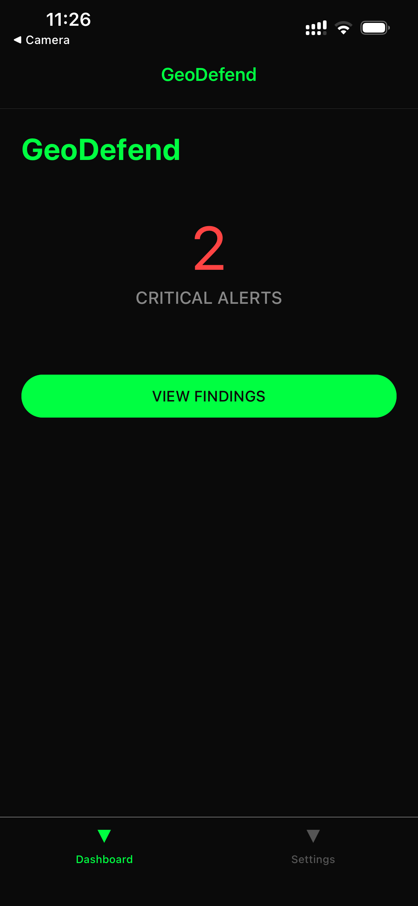
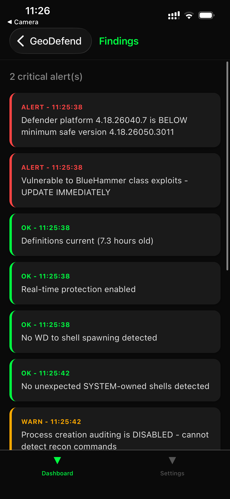
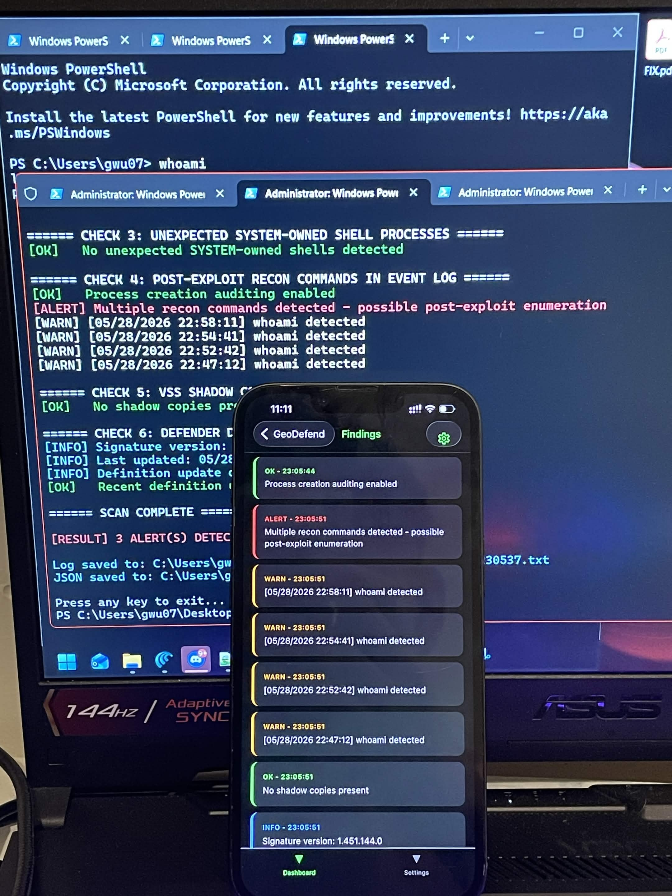
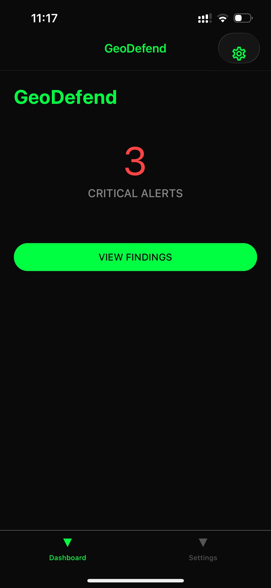

# GeoDefend

**Blue team mobile dashboard for Windows Defender LPE detection.**

GeoDefend is a React Native mobile app that consumes the output of `WD_LPE_Detect.ps1` — a PowerShell scanner built to detect active indicators of compromise for a class of Windows Defender Local Privilege Escalation (LPE) exploits. Run the scanner on your Windows machine, serve the output over LAN, read the results on your phone in real time.

| Dashboard | Findings | Location |
|:---------:|:--------:|:--------:|
|  |  |  |

---

## Why This Exists

In 2025–2026, a security researcher known as **nightmare-eclipse** (formerly at Microsoft) published six proof-of-concept exploits targeting Windows components — three of which weaponise Windows Defender itself as the escalation vector. The core finding across the body of work: **Windows Defender's elevated trust and SYSTEM-level execution make it an ideal pivot point for privilege escalation from a standard user account.**

No admin required for any of them. No UAC prompt. Any code execution at user level — a malicious attachment, a compromised browser plugin — can chain into any of these for a full SYSTEM shell.

GeoDefend is a tool for detecting whether any of these attacks are active or have been active on a given machine. The PS1 scanner runs the checks; this app surfaces the output.

---

## The Threat Landscape

### BlueHammer
TOCTOU (Time-of-Check Time-of-Use) oplock race condition in Windows Defender. Defender runs as SYSTEM and performs file operations. User-mode oplocks can pause those operations mid-flight. The attacker pauses Defender, swaps the target file via symlink or rename, then releases — Defender's SYSTEM write lands on the attacker's chosen path. **Primary IOC: Defender process spawning a child shell.**

> *"I'm just really wondering what was the math behind their decision, like you knew this was going to happen and you still did whatever you did?"* — nightmare-eclipse

Minimum safe platform version: `4.18.26050.3011`

### MiniPlasma
Exploits `cldflt!HsmOsBlockPlaceholderAccess` in the Cloud Files minifilter driver — the same function reported to Microsoft by James Forshaw (Google Project Zero) in 2020 as CVE-2020-17103, supposedly patched, and apparently unpatched or silently rolled back.

Four-stage chain: race condition → arbitrary registry write → NT symlink redirect → `windir` environment variable hijack → Windows Error Reporting (WER) abused to execute a fake `wermgr.exe` as SYSTEM via named pipe.

> *"I'm unsure if Microsoft just never patched the issue or the patch was silently rolled back at some point for unknown reasons."* — nightmare-eclipse

Scope per the developer: *"all Windows versions affected."*

### GreenPlasma
CTFMON.exe (Microsoft CTF Monitor, handles keyboard/language input) allows a standard user to create a named memory section object in a SYSTEM-writable directory. Services and kernel drivers trust named sections at certain paths. Intentionally released as an incomplete CTF challenge — the full exploit chain is withheld. Predecessor to MiniPlasma's technique.

Affected: Windows 11, Server 2022, Server 2026. Windows 10 uncertain.

### UnDefend
Neutralises Windows Defender without admin access, no crash, no tamper alert.

- **Passive mode:** blocks all signature updates. Defender keeps running, looks healthy, but goes blind to any threat newer than the last successful update.
- **Aggressive mode:** causes Defender to stop responding entirely. Effectiveness varies with platform version.
- **Unreleased:** the developer found a method to spoof EDR consoles into showing Defender as fully operational while it's dead. Withheld *"due to the potential of harm."*

**Hardest to detect of the six** — produces absence of events, not suspicious ones.

### RedSun
Logic inversion in how Defender handles cloud-tagged files. Normal behaviour: detect malicious file → delete/quarantine. Actual behaviour with cloud tags: detect malicious file → **restore** the "original" from the cloud pointer. The attacker crafts a cloud-tagged file pointing to a malicious "original," baits a scan, and Defender's restore logic overwrites a system path with SYSTEM privilege.

> *"The antivirus became the privilege escalation vector."* — nightmare-eclipse

### YellowKey
BitLocker full-volume bypass for Windows 11 and Server 2022/2025. Place a crafted `FsTx` folder in `System Volume Information` on a USB drive or EFI partition → boot into Windows Recovery Environment → `SHIFT+CTRL` → shell with full access to the BitLocker-encrypted volume (WinRE holds recovery keys in scope for recovery operations).

The developer notes the responsible component *"is not present anywhere except inside WinRE image"* but appears with identical naming in standard installs — implying the bypass may be intentional design.

Credits to MORSE, MSTIC, Microsoft GHOST for enabling public disclosure.

Affected: Windows 11 ✓, Server 2022 ✓, Server 2025 ✓. Windows 10 unaffected.

---

## Architecture

```
┌─────────────────────────────────┐
│  WD_LPE_Detect.ps1 (Admin)      │  Runs 6 detection checks
│  Windows Machine                │  Writes WD_LPE_Latest.json to Desktop
└──────────────┬──────────────────┘
               │
               ▼
┌─────────────────────────────────┐
│  python -m http.server 8765     │  Serves Desktop as static files
│  Same machine                   │  JSON accessible over LAN
└──────────────┬──────────────────┘
               │  http://<LAN-IP>:8765/WD_LPE_Latest.json
               ▼
┌─────────────────────────────────┐
│  GeoDefend (Expo Go / APK)      │  Fetches + displays scan results
│  Phone (same Wi-Fi network)     │  Dashboard: alert count + status
└─────────────────────────────────┘
```

The JSON payload shape:
```json
{
  "timestamp": "2026-05-26T21:00:00",
  "host": "DESKTOP-XXXX",
  "user": "username",
  "alertCount": 2,
  "findings": [
    { "level": "ALERT", "message": "...", "time": "21:00:01" },
    { "level": "OK",    "message": "...", "time": "21:00:02" }
  ]
}
```

---

## What the Scanner Checks

| Check | What it detects | Exploit covered |
|-------|-----------------|-----------------|
| 1 — Platform version | WD version below `4.18.26050.3011`; definitions stale; RTP disabled | BlueHammer gate, UnDefend aggressive |
| 2 — WD spawning shells | MsMpEng / MpCmdRun / MpDefenderCoreService spawning cmd/powershell | BlueHammer **primary IOC** |
| 3 — SYSTEM-owned shells | cmd/powershell running as SYSTEM from unexpected parent | Post-exploit any of the 6 |
| 4 — Recon commands in event log | whoami, cmdkey, net group, nltest etc. in Security log (EID 4688) | Post-exploit enumeration |
| 5 — VSS shadow copy activity | Unexpected shadow copies | Post-exploit persistence |
| 6 — Definition update health | No recent writes to Defender Definition Updates directory | UnDefend **primary IOC** |

**Detection gaps not yet covered:**
- `windir` registry key value (MiniPlasma Stage 3)
- Cloud-tag attributes on system-directory files (RedSun)
- WinRE boot event monitoring (YellowKey)
- CTFMON section object anomalies (GreenPlasma)

---

## Live Test — Recon Detection (2 → 3 Alerts)

**Objective:** Simulate post-exploit enumeration and confirm GeoDefend detects the pattern change in real time.

**Setup:** Process creation auditing enabled via `auditpol`. Recon command sequence executed on the target machine. Scanner re-run. App refreshed over LAN.

| Recon Detected (Findings) | Dashboard — 3 Critical Alerts |
|:-------------------------:|:-----------------------------:|
|  |  |

**What changed:**

| State | Alerts | Trigger |
|-------|--------|---------|
| Baseline | 2 | Platform version below minimum + process auditing disabled |
| After recon simulation | 3 | `whoami`, `net user`, `ipconfig`, `tasklist`, `systeminfo` sequence detected in Security event log (EID 4688) |

Check 4 fires when multiple recon commands appear in the event log within a short window — the pattern of an attacker who just landed on a box and is enumerating their environment. Single commands do not trigger it; the sequence does.

> *"Can't really 0day myself but we'll run a recon command to see if the mobile app shows results."*

---

## Setup

### Prerequisites
- Windows machine with Windows Defender enabled
- Python 3 (built into Windows 11)
- Node.js + npm
- Expo Go on your phone ([Android](https://play.google.com/store/apps/details?id=host.exp.exponent) / [iOS](https://apps.apple.com/app/expo-go/id982107779))
- Both machine and phone on the same Wi-Fi network

### 1 — Run the PS1 scanner

Right-click `WD_LPE_Detect.ps1` → Run as Administrator. This writes `WD_LPE_Latest.json` to your Desktop.

### 2 — Start the file server

```bash
cd C:\Users\<you>\Desktop
python -m http.server 8765
```

Confirm: open `http://localhost:8765/WD_LPE_Latest.json` in your browser.

### 3 — Set your LAN IP

Find it with `ipconfig` — look for IPv4 Address under your Wi-Fi adapter.

In `screens/DashboardScreen.js`:
```javascript
const SCAN_URL = "http://192.168.1.92:8765/WD_LPE_Latest.json";
//                         ^^^^^^^^^^^^^ replace with your IP
```

### 4 — Run the app

```bash
npm install
npx expo start
```

Scan the QR code with Expo Go. Dashboard loads and fetches the latest scan result.

---

## Project Structure

```
GeoDefend/
├── App.js                  Navigation shell (bottom tabs + stack)
├── index.js                Entry point — registerRootComponent
├── WD_LPE_Detect.ps1       Scanner — run as Admin on Windows machine
├── BUILD_GUIDE.md          Full step-by-step build log
├── screens/
│   ├── DashboardScreen.js  Alert count display, fetch logic
│   ├── FindingsScreen.js   Findings list grouped by level (in progress)
│   └── SettingsScreen.js   Server IP config (in progress)
└── package.json            "main": "index.js" — required for SDK 54
```

**Why `index.js` exists:** Expo SDK 54 scaffolds with Expo Router by default (`"main": "expo-router/entry"`). This project uses the traditional App.js pattern. `index.js` + `registerRootComponent` + `"main": "index.js"` in package.json overrides the router entry point.

---

## Stack

| Layer | Library | Version |
|-------|---------|---------|
| Framework | Expo | SDK 54 |
| Navigation | React Navigation | v7 |
| UI components | React Native Paper | v5 |
| Entry point | registerRootComponent | expo |

---

## Credit

The exploit research this scanner is built around is the work of **nightmare-eclipse**, an independent security researcher and former Microsoft employee. The six PoC tools — BlueHammer, MiniPlasma, GreenPlasma, UnDefend, RedSun, and YellowKey — represent a sustained body of original Windows security research, much of it surfacing vulnerabilities that were reported to Microsoft, marked as fixed, and found still exploitable years later.

- GitLab: [gitlab.com/nightmare-eclipse](https://gitlab.com/nightmare-eclipse)
  - [BlueHammer](https://gitlab.com/nightmare-eclipse/BlueHammer)
  - [MiniPlasma](https://gitlab.com/nightmare-eclipse/MiniPlasma)
  - [GreenPlasma](https://gitlab.com/nightmare-eclipse/green-plasma)
  - [UnDefend](https://gitlab.com/nightmare-eclipse/un-defend)
  - [RedSun](https://gitlab.com/nightmare-eclipse/RedSun)
  - [YellowKey](https://gitlab.com/nightmare-eclipse/YellowKey)

CVE-2020-17103 (MiniPlasma root vulnerability) originally discovered and reported by James Forshaw, Google Project Zero.

---

*Blue team. For educational and defensive use only.*
